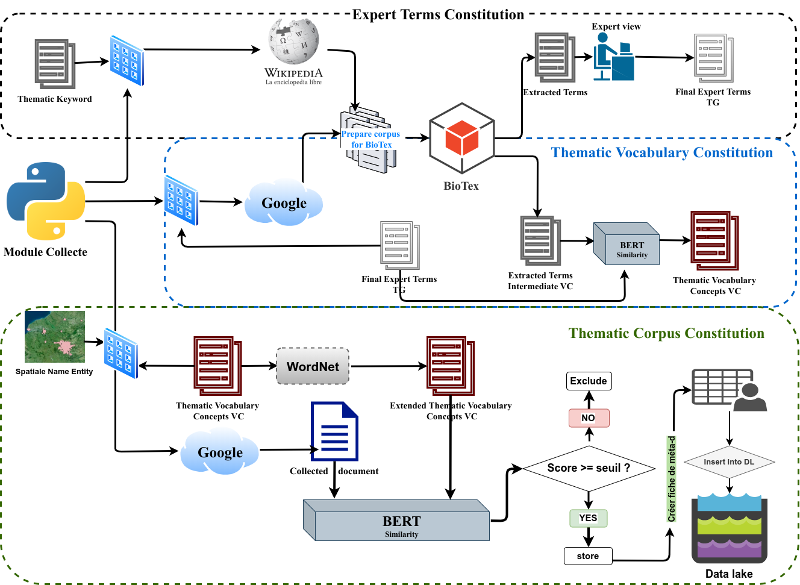

# Pre-requis

## Installer Biotex via BioTex repository [via BioTex repository](https://gitlab.irstea.fr/jacques.fize/biotex_python)

## Installer [Mongodb](https://www.digitalocean.com/community/tutorials/how-to-install-mongodb-on-ubuntu-18-04)

# Protocole de collecte de données textuelles pour la constitution de corpus thématiques
Les différentes étapes du protocoles sont entre autres:

## 1. La constitution de termes experts
La liste de termes experts est obtenue en deux étapes

* tout d'abord, pour une thématique donnée, nous collectons des données (une dizaine pages) sur wikipédia en utilisant le mot clé thématique (ex: agriculture). Cette étape est réalisée à partir des données de wiki dans le  but d'obtenir des documents bien centrés, telsque des défnitions, historique, etc. Ce qui donnera un large choix aux experts sur les termes qui représenteront au mieux sémantiquement chaque thématique.
* ensuite, pour chaque mini corpus, nous utilisons Biotex pour extraire des ensembles de termes. Les termes obtenus des mésures (f-tfidf-cm, c_value) sont fusionnés pour obtenir un seul ensemble. 
* enfin, avec un avis expert, nous retenons ~100 termes pour chaque thématique. 
Toujours, en se basant sur le principe d'expansion par graine, les termes experts ainsi obtenus, seront utilisés pour la constitution des vocabulaires de concepts.

## 2. La constitution de vocabulaire de concepts
Le vocabulaire de concetps est obtenu en 04 étapes
* la premiere consiste à utiliser les termes experts obtenus précédemment pour recolter des données sur Google, dans le but d'obtenir des données plus diversifées, en terme de contenu, que dans les sources.
* deuxiemement, pour chaque thématique, le corpus obtenu est utilisé pour extraire des ensembles de termes en utilisant BioTex comme dans l'étape 1).
* troisiement, afin de s'assurer que ces termes sont sémantiquement valides vis-à-vis de la thématique, nous introduisons une mesure de similarité en utilisant DistilBert. Ce calcul de similarité est évalué entre chacun des termes obtenus avec l'ensemble de la liste de termes experts obtenue en 1).
* le dernier point consiste à ordonner par ordre décroissant, les termes suivants leur score de similarité. Ceux ayant les plus grand score étant les plus proches de la thématique, sémentiquement parlant. Dans notre étude, nous avons retenu les 1000er de chaque thématique, correspondant à des seuils > 0.7

## 3. La constitution des corpus thématiques
La constitution des corpus thématique qui est la derniere étape se décrit en 03 étapes
* Idem à 1) et 2), les vocabulaires de concepts sont utilisés pour collecter des documents sur Google et former ainsi de gros corpus thématiques.

* Pour s'assurer de la qualité des contenus des documents que nous collectons, nous avons mis en place une évaluation automatisée, basée sur la mesure de similarité proposée précédement avec DistilBert.  Cette mesure de similarité est faite pour chaque  document collecté, avec le vocabulaire de concepts étendus. Pourquoi un vocabulaire de concepts étendus ? Nous proposons d'utiliser un vocabulaire de concepts étendus pour chaque thématique lors de la collecte, dans le but de pouvoir prendre en compte les documents de nature sociétale, dont le contenu contient un language moins soutenu (orienté société ou language de la majorité), généralement en provenance des forums blogs etc. Le vocabulaire de concepts étendus est obtenu en génerant pour chaque terme du vocabulaire initial, des synonymes en utilisant WordNet.

* Les documents obetenus, avec leur score de similarité sont ainsi classés par ordre décroissant, les scores les plus élevés correspondent aux documents les plus pertinents vis-à-vis de leur contenu. 

`# _Confère fichier container_v2.ipynb pour application_
`
### NB: Les corpus thématiques peuvent être obtenus en exécutant directement l'épate "3 - Final step to build thematic corpora" du fichier container.ipynb car les vocabulaires de concepts sont déjà élaborés dans le repertoir ./voc_concepts
